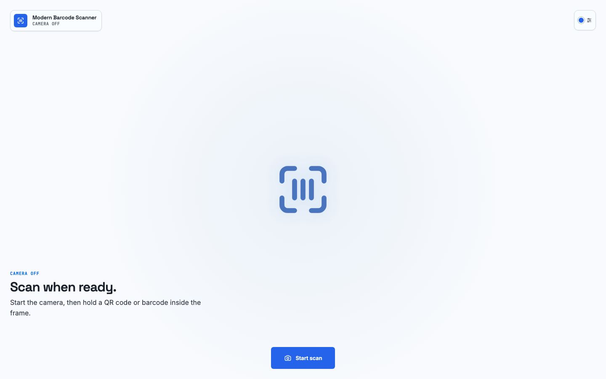

# Scanner interface design audit

## Outcome

The scanner interface was visually reviewed end to end on 2026-08-12. Idle, camera-starting, active-camera, successful-result, and recoverable-error states remain legible and contained across desktop, tablet, and mobile layouts.

Hallmark result: **0 critical · 0 major · 0 minor**.



## Design system

- Genre: modern-minimal
- Macrostructure: Workbench
- Theme: Cobalt
- Tone: precise, calm, technical
- Type: Space Grotesk display, Inter body, JetBrains Mono labels
- Icon language: custom 24 × 24 SVG grid, 1.75 px optical stroke, round caps and joins
- Brand consistency: the canonical scan-frame logo is reused for both the brand mark and scanner standby state
- Viewfinder language: four balanced corner brackets, four calibration ticks, a one-pixel scan beam, and a restrained off-region scrim
- Motion: transform/opacity only, with reduced-motion fallbacks

The screenshot above is captured from the deterministic `?demo-state=idle` route at 1440 × 900. It is a UI reference, not a simulated browser or device frame.

## Layout matrix

| Layout         | Viewport   | States reviewed                       | Result                                                                 |
| -------------- | ---------- | ------------------------------------- | ---------------------------------------------------------------------- |
| Desktop        | 1440 × 900 | Idle, starting, active, result, error | No overflow or collision; hierarchy and asymmetry remain clear         |
| Tablet         | 768 × 1024 | Idle, starting, active, result, error | Viewfinder, dialog, error panel, and actions remain comfortably spaced |
| Mobile         | 375 × 812  | Idle, starting, active, result, error | Compact brand treatment and stacked dialog actions remain legible      |
| Compact mobile | 320 × 568  | Idle, starting, active, result, error | No clipped surfaces; controls retain 44 px minimum targets             |
| Wide mobile    | 414 × 896  | Idle, starting, active, result, error | Full brand label returns without crowding the theme control            |

All 25 combinations had zero document-level horizontal and vertical overflow. Visible text actions remained on one line, and every interactive control measured at least 44 × 44 CSS pixels.

## State findings

| State    | Visual checks                                                                                         |
| -------- | ----------------------------------------------------------------------------------------------------- |
| Idle     | Brand, ready mark, instructional hierarchy, accent picker, and primary action remain distinct         |
| Starting | Progress state is communicated through label, camera symbol, and restrained motion                    |
| Active   | Viewfinder is dominant; hint, stop action, camera switch, and torch controls do not overlap           |
| Result   | Native dialog remains centered and contained; result value wraps safely; initial focus is visible     |
| Error    | Alert icon, recovery text, retry, and close actions remain legible without exposing raw decoder codes |

## Automated coverage

The visual review is backed by browser assertions in `tests/browser/visual-layout.spec.ts`:

- the full state matrix at 320, 375, 414, 768, and 1440 px widths;
- zero horizontal overflow and full-viewport containment;
- 44 px control targets and single-line button labels;
- non-overlapping active-camera controls;
- viewfinder bracket, tick, border, and scan-line geometry;
- compact result-dialog sizing and focus containment;
- dark-mode and reduced-motion behavior.

The latest local verification completed 163 unit/integration tests in both default and serialized modes, plus 15 Chromium, WebKit, and Chromium fake-camera browser tests. The configured Firefox project could not launch on the local macOS host and stalled before executing application code; CI retains Firefox coverage.

## Reproducing the review

Start the demo:

```bash
npm run dev
```

Open the camera-free component matrix:

```text
http://localhost:8080/visual.html?visual-audit
```

Open a complete deterministic state by replacing `<state>` with `idle`, `starting`, `active`, `result`, or `error`:

```text
http://localhost:8080/visual.html?demo-state=<state>
```

Run the automated gates:

```bash
npm run check
npm test
npx playwright test --project=chromium --project=webkit --project=chromium-camera
```
